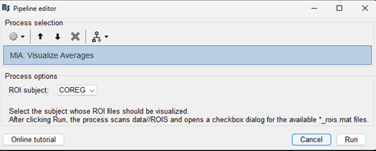
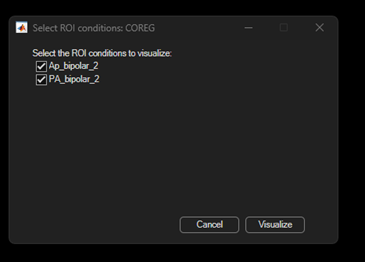
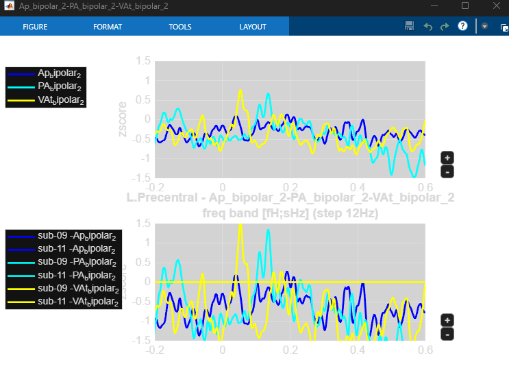

# 1) Using MIA concatenate channel function

Path: `MIA/bst_plugin/process_concatenate_channels.m`

This process creates one new grand subject that contains the channels of the selected subjects in the current Brainstorm protocol. This makes the later ROI-based MIA analysis easier to run on a common channel space.

Brainstorm menu:
`Run -> Add process icon -> Standardize -> MIA: Concatenate Channels`

<p float="left">
  
  
</p>

It contains 2 input fields:

1. **New subject name**
The custom name of the grand subject that will be created. Default name: `COREG`.

2. **Subjects to skip**
Comma-separated list of subjects that should not be included in the concatenation. Leave empty to include all subjects.

Example:
`Subject01, Subject02`

Then click `Run`.

# 2) Calculating time/frequency with Morlet method

Path: `Mia/bst_plugin/process_mia_extract_tf.m`

This process calculates time/frequency representations of Brainstorm data using the Morlet wavelet method. It uses the current Brainstorm protocol, the condition dropped in `Process1`.

Brainstorm menu: `Frequency -> MIA: Time-frequency (Morlet by band + 1/f norm)`

<p float="left">
  
  
</p>

It contains the following input fields:

1. **Baseline**
The time window (in milliseconds) used as the baseline for 1/f normalization. You can specify a start and end time (e.g., `-400.0` to `-1.0` ms) or check the `All file` box to use the entire file as baseline.

2. **Frequency bands**
The frequency range and steps to extract. Follows the MATLAB array format `start:step:end` (e.g., `50:10:170` to extract frequencies from 50Hz to 170Hz with a 10Hz step).

3. **Number of cycles**
The number of cycles for the central frequency of the Morlet wavelet (e.g., `7`), which defines the time-frequency resolution trade-off.

Then click `Run`.


# 3) Using MIA: Convert from BST to MIA function

Path: `MIA/bst_plugin/process_mia_bst2mia.m`

This process converts Brainstorm data to MIA ROI data using the current Brainstorm protocol, the condition dropped in `Process1`, the selected subject channel file, and the labeling table.

Brainstorm menu:
`Run -> Add process icon -> Test -> MIA: Convert from BST to MIA`

<p float="left">
  
  
</p>

## Current inputs

The process now contains 3 user-facing inputs:

1. **Files in Process1**
Drop one condition from the Brainstorm database. The process reads the condition automatically from the first dropped input with:
`sInputs(1).Condition`

1. **Labeling table (TSV)**
Path to the `.tsv` file containing the labeling information.

1. **Channel subject**
Dropdown listing the subjects in the current Brainstorm protocol. The selected subject is used to resolve the `channel.mat` file automatically from the protocol studies directory.

1. **Subjects to skip**
Comma-separated list of subjects to exclude from the conversion. Leave empty to use all eligible subjects.

Example:
`Subject01, Subject02`

Then click `Run`.

At the end this will create an ROI file `ConditionName_rois.mat` in the `brainsrtoem_protocol_dir/data/group_subject(COREG)/ROIS` folder for each converted condition, where `ConditionName` is the name of the condition dropped in Process1.

   
# 4) Using MIA: Visualize Averages function

Path: `MIA/bst_plugin/process_mia_group_gui.m`

This process opens `mia_group_gui` directly from ROI files already saved in the current Brainstorm protocol.

Brainstorm menu:
`Run -> Add process icon -> Test -> MIA: Visualize Averages`

<p float="left">
  
  
  
</p>


## Individual condition visualization:
<div style="display: flex; align-items: flex-start; gap: 20px;">
  
  
</div>
<br>
<div>
  
</div>

## Group comparison visualization:
<div style="display: flex; align-items: flex-start; gap: 20px;">
  
  
</div>
<br>
<div>
  
</div>


## Current inputs

The process contains 1 user-facing input:

1. **ROI subject**
Dropdown listing the subjects in the current Brainstorm protocol. The selected subject is used to find ROI files inside:
`data/<SelectedSubject>/ROIS`

Then click `Run`.


## Updated workflow in `process_mia_group_gui.m`

The process now works as follows:

1. Read the current Brainstorm protocol automatically:
`prot = bst_get('ProtocolInfo');`

2. Read the selected subject from the dropdown.

3. Scan the ROI folder of the selected subject:
`data/<SelectedSubject>/ROIS`

4. Find all files matching:
`*_rois.mat`

5. Convert each filename into a condition name by removing the suffix:
`_rois.mat`

Example:
`Ap_bipolar_2_rois.mat -> Ap_bipolar_2`

6. Open a checkbox dialog so the user can select one or more conditions to visualize.

7. Load the `rois` variable from each selected file.

8. Call `mia_group_gui(...)` with the selected ROI structures.


## Behavior of the final call

If one condition is selected, the process calls:

```matlab
mia_group_gui(selectedRois{1}, selectedConditionNames{1});
```

Equivalent example:

```matlab
Ap_bipolar_2_file = load('data/COREG/ROIS/Ap_bipolar_2_rois.mat', 'rois');
mia_group_gui(Ap_bipolar_2_file.rois, 'Ap_bipolar_2');
```

If multiple conditions are selected, the process calls:

```matlab
mia_group_gui(selectedRois{:}, strjoin(selectedConditionNames, '-'));
```

Equivalent example:

```matlab
cond_1_file = load('data/COREG/ROIS/cond_1_rois.mat', 'rois');
cond_2_file = load('data/COREG/ROIS/cond_2_rois.mat', 'rois');
mia_group_gui(cond_1_file.rois, cond_2_file.rois, 'cond_1-cond_2');
```


## Helper functions added in `process_mia_group_gui.m`

### `get_protocol_subject_options()`

This helper reads all subjects from the current Brainstorm protocol and uses them to populate the `ROI subject` dropdown.


### `get_subject_roi_files(roiDir)`

This helper scans the selected subject ROI folder, finds all `*_rois.mat` files, sorts them, and extracts the condition names from the filenames.


### `select_roi_conditions(conditionNames, subjectName)`

This helper opens the checkbox dialog displayed after clicking `Run`. It lets the user choose which available ROI conditions should be passed to `mia_group_gui(...)`.


## 5) Run Stats

This process performs statistical contrast between two conditions. 

**Steps:**

1. **Drag and drop the 2 conditions** needed for statistical contrast into the process.
   - You need to select exactly 2 conditions that you want to compare statistically
   - These conditions should be from your processed data

2. **Follow the process menu as shown in the image:**

<p float="left">
  
</p>

3. The process will:
   - Load the data from both conditions
   - Compute statistical contrasts between them
   - Generate statistical results including p-values and effect sizes
   - Save the results for visualization and further analysis

need to install the packages:
1) signal processing toolbox (for filtfilt)
2) statistics and machine learning toolbox (for tinv)